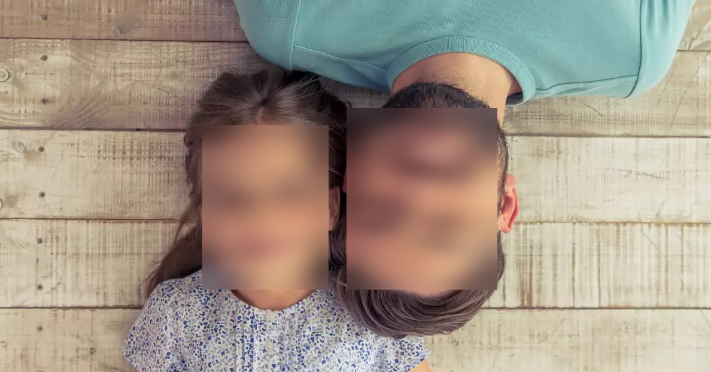

# [How to Blur Faces in Images using OpenCV in Python](https://www.thepythoncode.com/article/blur-faces-in-images-using-opencv-in-python)

To run this:

- `pip3 install -r requirements.txt`
- To blur faces of the image `father-and-daughter.jpg`:

    ```bash
    python blur_faces.py father-and-daughter.jpg
    ```

    This should show the blurred image and save it of the name `image_blurred.jpg` in your current directory.

- To blur faces using your live camera:

    ```bash
    python live-blur-faces.py
    ```

- To blur faces of a video:

    ```bash
    python video-blur-faces.py video.mp4
    ```

## Face Detection and Blurring Application

This code is a simple face detection and blurring application using OpenCV. It detects faces in real-time from the default camera feed and applies a Gaussian blur to them. Here are the steps involved:

1. Import the necessary libraries: cv2, numpy, and time.

2. Define the paths to the prototxt file and model file for the Caffe model.

3. Load the Caffe model using `cv2.dnn.readNetFromCaffe()`.

4. Connect to the default camera using `cv2.VideoCapture()`.

5. Enter a forever loop to continuously detect faces and apply blurring.

6. Read the live frames from the camera capture.

7. Get the width and height of the image.

8. Preprocess the image by resizing it to (300, 300) and subtracting the mean values.

9. Set the preprocessed image as the input to the neural network model.

10. Perform inference and get the output from the model.

11. Loop through the detected faces and check their accuracy level.

12. If the face accuracy is above 40%, blur the bounding box region.

13. Apply Gaussian blur to the detected face region.

14. Replace the original face region with the blurred face in the image.

15. Display the final image with blurred faces.

16. Break the loop if the user presses the 'q' key.

17. Calculate the frames per second (FPS) of the processing loop.

18. Close all OpenCV windows and release the camera capture.

Please note that this code assumes the presence of the necessary model files and weights in the specified paths.

## The output image is blurred

  

## Path prototxt model Caffe

```python
# https://raw.githubusercontent.com/opencv/opencv/master/samples/dnn/face_detector/deploy.prototxt
prototxt_path = "weights/deploy.prototxt.txt"
```

## Path model Caffe

```python
# https://raw.githubusercontent.com/opencv/opencv_3rdparty/dnn_samples_face_detector_20180205_fp16/res10_300x300_ssd_iter_140000_fp16.caffemodel
model_path = "weights/res10_300x300_ssd_iter_140000_fp16.caffemodel"
```

## The explanations of [Live blur faces.py](live-blur-faces.py)

The file code is a Python program that uses OpenCV (cv2) library to capture video from the default camera, detect faces in real-time, and apply a blur effect on those faces. Here is a breakdown of the code:

1. Import necessary libraries:

    ```python
    import cv2
    import numpy as np
    import time
    ```

    The code imports the cv2 library for computer vision operations, numpy for array manipulation, and time for timing purposes.

2. Specify the paths of the prototxt model and caffe model files:

    ```python
    prototxt_path = "weights/deploy.prototxt.txt"
    model_path = "weights/res10_300x300_ssd_iter_140000_fp16.caffemodel"
    ```

    These paths point to the prototxt model file and the caffe model file respectively. These files define the pre-trained face detection model.

3. Load the Caffe model:

    ```python
    model = cv2.dnn.readNetFromCaffe(prototxt_path, model_path)
    ```

    This line loads the Caffe model using the `readNetFromCaffe()` function from OpenCV's dnn module.

4. Open the default camera:

    ```python
    cap = cv2.VideoCapture(0)
    ```

    This line opens the default camera (index 0) using the VideoCapture() function.

5. Start a loop for real-time face detection and blurring:

    ```python
    while True:
        start = time.time()
        live, image = cap.read()
        # ... rest of the code ...
    ```

    This `while` loop continuously captures frames from the camera until the user quits the program. It starts by capturing a frame from the camera using the `cap.read()` function.

6. Preprocess the image and perform inference:

    ```python
    h, w = image.shape[:2]
    kernel_width = (w // 7) | 1
    kernel_height = (h // 7) | 1
    blob = cv2.dnn.blobFromImage(image, 1.0, (300, 300), (104.0, 177.0, 123.0))
    model.setInput(blob)
    output = np.squeeze(model.forward())
    ```

    This code calculates the height and width of the captured frame. It then creates a blob (binary large object) from the image using `cv2.dnn.blobFromImage()`, which prepares the image for input to the neural network model. The preprocessed image is then passed as input to the model using `model.setInput()` and the output is obtained using `model.forward()`.

7. Loop over the detected faces and apply blur effect:

    ```python
    for i in range(0, output.shape[0]):
        face_accuracy = output[i, 2]
        if face_accuracy > 0.4:
            box = output[i, 3:7] * np.array([w, h, w, h])
            start_x, start_y, end_x, end_y = box.astype(np.int)
            face = image[start_y:end_y, start_x:end_x]
            face = cv2.GaussianBlur(face, (kernel_width, kernel_height), 0)
            image[start_y:end_y, start_x:end_x] = face
    ```

    In this loop, each detected face is checked for its accuracy (`face_accuracy`). If the accuracy is above a threshold (0.4), the bounding box coordinates are extracted from the output and used to crop the face region from the original image. Then, a Gaussian blur is applied to the cropped face region using `cv2.GaussianBlur()`. Finally, the blurred face region is placed back into the original image.

8. Display the resulting image and calculate FPS (frames per second):

    ```python
    cv2.imshow("Faces blurred v1.0", image)
    if cv2.waitKey(1) == ord("q"):
        break
    time_elapsed = time.time() - start
    fps = 1 / time_elapsed
    print("FPS:", fps)
    ```

    The code displays the resulting image with blurred faces using `cv2.imshow()` and waits for a key press to exit the program if 'q' is pressed (`ord("q")` returns the ASCII value of 'q'). It also calculates the time taken to process the current frame and calculates the frames per second (FPS).

9. Cleanup and release resources:

    ```python
    cv2.destroyAllWindows()
    cap.release()
    ```

    This code closes all OpenCV windows and releases the camera resource.

    That's a breakdown of the given Python code. It captures video from the default camera, detects faces in real-time, applies a blur effect on those faces, and displays the result with FPS information.
